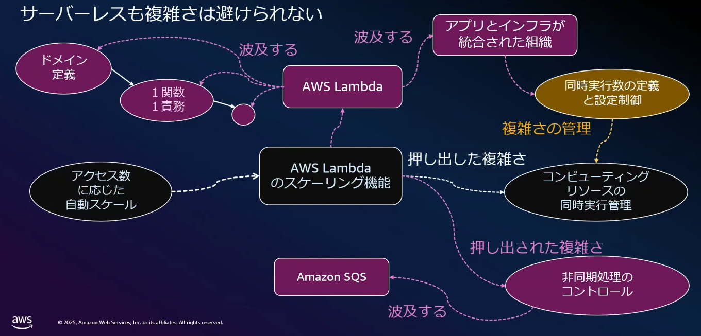
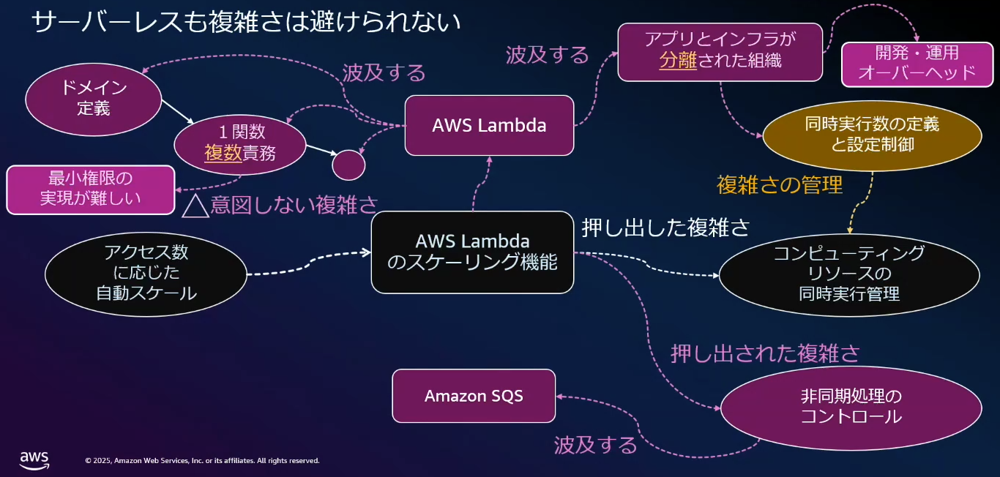
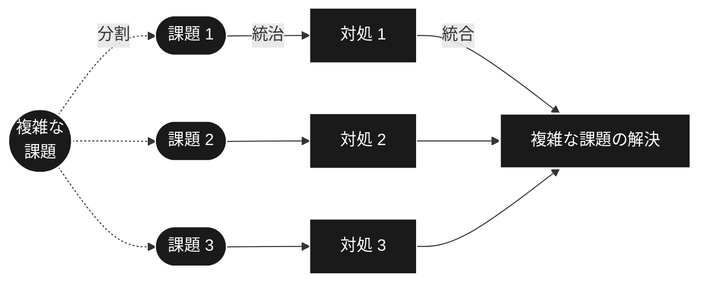
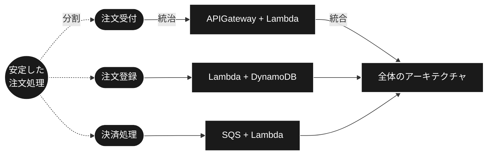
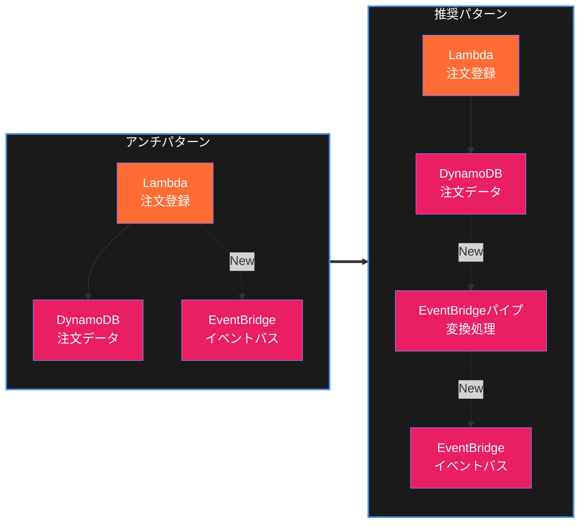

## Simplexityとは
シンプルさの原則に基づいて複雑なシステムを設計監理する考え方

複雑さ：要素の数、つながりの多さ

シンプルさ：扱いやすい状態（にする手段）

システムを作るときのフロー
- 目的を把握（何を作りたいのか）
  - ビジネス
- 構造やロジックを考える
  - アプリケーション
- 用いる技術を考える
  - テクノロジー

複雑さとシンプルさの例

|                  | 複雑さ（要素）                               | シンプルさ（扱いやすくする手段）          |
|------------------|----------------------------------------------|-------------------------------------------|
| ビジネス         | 顧客、ニーズ                                 | PMBOK、TOGAF                              |
| アプリケーション | データフロー、ドメイン、可用性定義、関数設計 | オブジェクト指向、SOLID、マイクロサービス |
| テクノロジー     | DB、言語、ストレージ、実行環境               | Framework、GenAI、K8s                     |

## CloudWatchの複雑さとの向き合い方

当初
- フロントエンドと読み書きするバックエンドというシンプルな構成

主にフロントエンドの機能開発が活発に
- フロントエンドだけが肥大化していく
- 修正や影響範囲が拡大し、テストの工数が増える → 扱いづらい状態

対応
- システムを細分化
- 疎結合かつ高凝集度
  - テストがしやすく、拡張性や信頼性が高い
- 明確に定義されたAPI
  - 分割したシステムの通信方式、エラー時の振る舞いを明確に定義

> [!NOTE]
> テスラーの法則
>
> 複雑さは意図的に作るものでも、消すものでもない。
>
> ただ、どこかに移動させることだけはできる。

## 複雑さの移動

1. 解決したい課題
   - アクセス数に応じたスケーリングをしたい
2. Lambdaのスケーリング機能を使う
   - スケーリングという複雑さをLambdaへ意図して押し出す
   - リソースの同時実行管理をLambdaへ任せる
3. 人間が複雑さの管理を行う
   - 同時実行数の定義と設定制御
4. 逆に、押し出された複雑さもある
   - Lambdaを使うことの複雑さ
     - ドメイン定義、関数の責務設計
     - アプリとインフラを統合して扱える組織であること
   - 非同期処理のコントロール
     - SQSへ複雑さが波及する

もし、1関数複数責務だったら

- 最小権限の実現が難しい

もし、アプリとインフラの統合ができない組織だったら

- 開発・運用で不必要な工数がかかる

△意図しない複雑さを生んでしまう可能性がある

## Simplexity戦略

### 分割統治

> [!IMPORTANT]
> 分割統治の考え方
> - 複雑な課題を分割して小さく分ける
> - 小さくした各課題を対処する
> - すべて統合して当初の課題解決とする

サーバーレスの分割統治の例「安定した注文処理を実現したい」

### 分割統治のKeyPoint

前提
- 複雑な課題を扱いやすくするために分割する

サーバーレスで分割統治をするには
1. 目的に沿って分割させる
  - 分割の手法であるアーキテクチャパターンは多く存在する
  - 機能単位で分割？業務単位で分割？ドメイン層などのレイヤー分割？
  - どこに複雑さを移動させるのか、何を実現したいのかを整理して分割をする

2. コミュニケーションがスムーズか
- 分割粒度にかかわらず、分割した要素は最終的には繋がるもの
- サービス間のインターフェイス定義が明確で、無駄なコミュニケーションが起きていないか？
- 例：EventBridgeのイベント定義が明確で、そのアクションが適切か

3. 調和が取れているか
- 個々のサービスが優れていても、全体のバランスが必要
- 全てのアーキテクチャにはトレードオフがある
  - 例：SQSのFIFOキューには順序保証があるがスループットは弱い
- それぞれの矛盾を理解して全体のバランスをとっていく

## 関心の分離

関心事を分離することでシンプルに複雑さを扱える
- テクノロジーがどの押し出された複雑さを引き受けるのか
- 人間が複雑さをどう管理するのか
- 逆に押し出された複雑さをどこに波及させるのか

### 関心の分離を行うためのKeyPoint

1. サーバーレスへ適切に任せる
- サービスごとの特徴を理解して、目的に応じて任せる
- サービスがどの関心ごとを引き受けてくれるのか？
- 人間がコントロールする必要のある関心ごとは何か？

| 例            | 人が考える領域 | 人がコントロールする関心ごと | サービスが引き受けてくれる関心ごと |
|---------------|----------------|------------------------------|------------------------------------|
| Lambda        | コード         | 同時実行数、メモリ管理       | コンピューティングリソース管理     |
| APIGateway    | REST設計       | アクセス制御                 | APIリソース管理                    |
| StepFunctions | 状態管理の定義 | ステートマシン定義           | 状態管理                           |

2. サーバーレスに任せるとは何もしないことではない
- サービスに任せた関心ごとの状況を把握し、改善を行っていく
- 適切に動作しているか？冪等性は担保されているか？
- ロギング、負荷テスト、非同期呼び出しの最適化など改善をする

3. サーバーレスを使いこなす力を持っているか
- アーキテクチャ選択にはトレードオフ検討が必要
- トレードオフ検討には情報を持っている必要がある
- 最新情報のキャッチアップ、サービス理解、アーキテクチャパターンの理解、組織状態

## 進化への対応

> [!NOTE]
> リーマンのソフトウェア進化の法則
>
> システムは継続的に改変しないと満足度が低下する
>
> システムの進化に伴い複雑さは増加する
>
> 適切なメンテナンスと変化への適応を行わないと品質が低下する

人やプロセスを考慮したテクノロジーであるべき
- 将来的な進化を見据えた機能は、人やプロセスに影響が波及する
- 管理する人のスキル、組織体制が十分か
- 多くの場合過剰な投資になる（YAGNI原則）

### 進化への対応を行うためのKeyPoint

1. 安全な手法で進化できるか
- EC2などではアプリケーションコードの修正で進化へ対応することが多い
- サーバーレスは新たなサービス追加で対応することを推奨
- 影響範囲を独立させ、管理するため

注文登録処理から新たなイベント追加を行いたいケース

Lambdaを修正するパターン
- 責務観点に懸念
- 変更時の影響範囲が大きくなる可能性がある
- EventBridgeパイプを使ったほうが安全

### 安心して進化できる状態か

組織として進化できる体制か
- 今の組織体制で境界が明確か、意思疎通はできているか
- 影響するチームとの認識はとれているか
- 継続的にFBを回せる体制になっているか
- 進化に対応できる人、プロセスを作っていく

### 止まらない文化はあるか

進化に対応する文化を醸成する
- テクノロジー、プロセス、人は三位一体
- 組織の心理的安全性を担保する
  - 非難があるチームは進化に対応できなくなる
- 継続的なフィードバックループを行う

